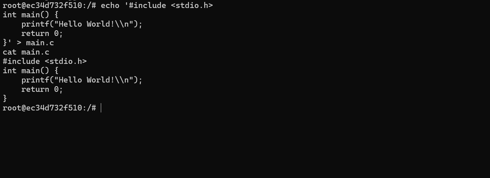
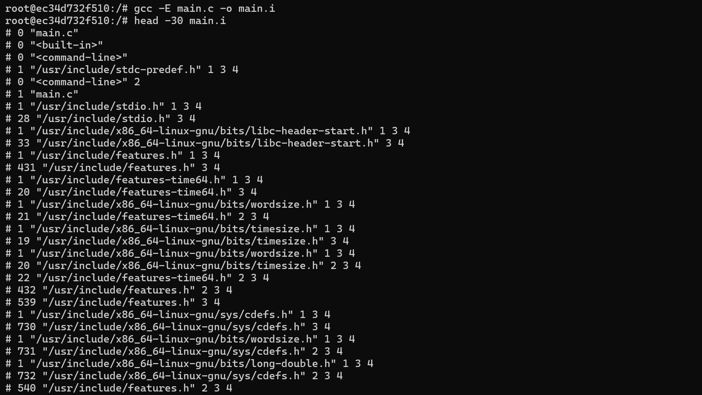
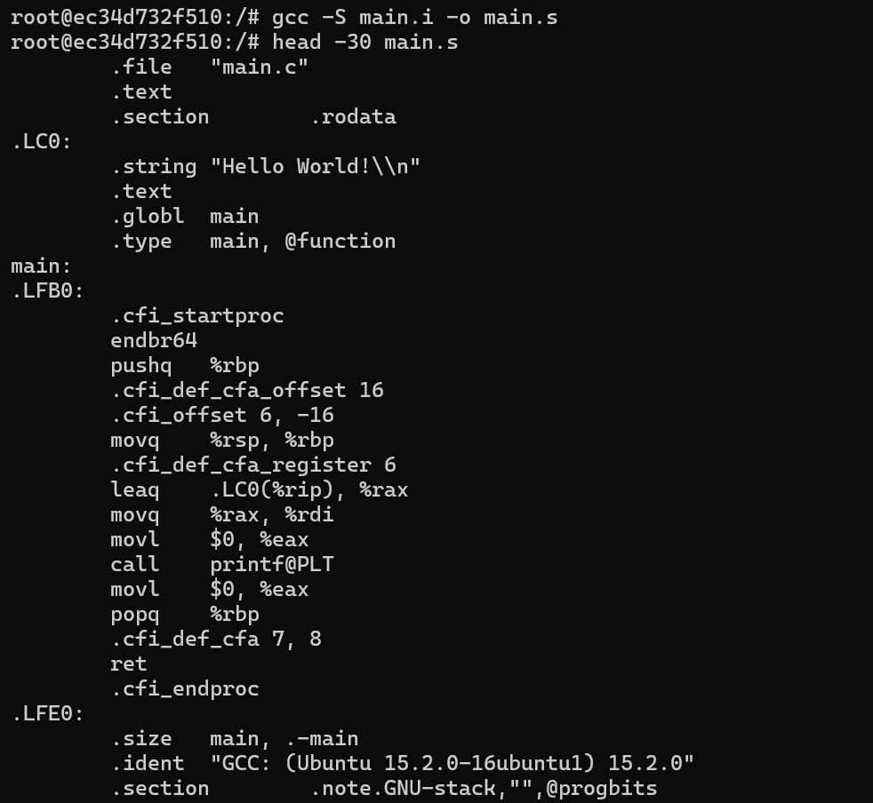
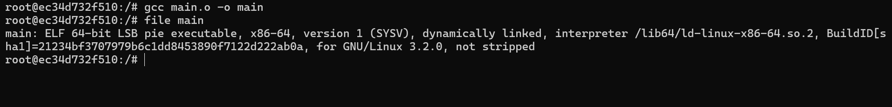
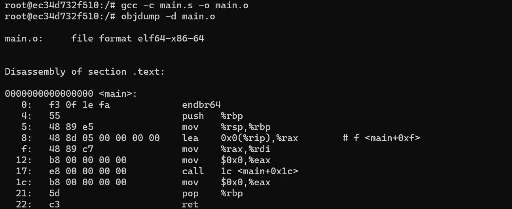

# Lab 2: GCC Compilation Process: Step-by-Step Guide
## Comprehensive Technical Report & Systems Documentation

**Course:** ST5039CMD Programming and Operating System  
**Module:** C-Programming Basics / Integration and Process Concept (Lecture 2 & Lab 2)  
**Author:** Bablu Ray  

---

## I. Executive Introduction & Learning Objectives

The compilation of a high-level C program into a machine-executable binary is a foundational concept in systems programming and computer architecture. A computer CPU cannot directly parse or execute human-readable C statements; it understands only binary machine code (0s and 1s) formatted according to the target instruction set architecture (ISA).

The **GNU Compiler Collection (GCC)** orchestrates this transformation through four distinct, sequential stages:
1. **Preprocessing** (`cpp` / `gcc -E`): Macro resolution, header inclusion, comment stripping, and linemarker generation.
2. **Compilation** (`cc1` / `gcc -S`): Semantic parsing, AST lowering, optimization, and target assembly language emission.
3. **Assembly** (`as` / `gcc -c`): Translation of assembly mnemonics into relocatable machine object code (ELF format).
4. **Linking** (`ld` / `collect2`): Symbol resolution against standard dynamic libraries (`libc`), PLT/GOT setup, and final executable binding.

This documentation provides a comprehensive, step-by-step practical demonstration of each phase, mapping directly to **Lecture 2** and **Lab 2**.

---

## II. C Program Structure & Compilation Flow

### 1. Standard C File Structure
A standard C source file adheres to a structured organizational hierarchy:

```
  ┌────────────────────────────────────────────────────────┐
  │ 1. Documentation Section   (/* Program description */) │
  ├────────────────────────────────────────────────────────┤
  │ 2. Preprocessing Section   (#include, #define)         │
  ├────────────────────────────────────────────────────────┤
  │ 3. Definition Section      (Global variables, types)   │
  ├────────────────────────────────────────────────────────┤
  │ 4. Main Function Body      (int main(void) { ... })    │
  ├────────────────────────────────────────────────────────┤
  │ 5. Subprogram / Helper     (void helper_func(void))    │
  └────────────────────────────────────────────────────────┘
```

### 2. High-Level Compilation Pipeline

```
  [ Source Code: main.c ]
            │
            │  Stage 1: Preprocessing (gcc -E)
            ▼
  [ Preprocessed File: main.i ]
            │
            │  Stage 2: Compilation (gcc -S)
            ▼
  [ Assembly File: main.s ]
            │
            │  Stage 3: Assembly (gcc -c)
            ▼
  [ Relocatable Object: main.o ]
            │
            │  Stage 4: Linking (gcc / ld)
            ▼
  [ Final Executable: main (ELF) ]
            │
            │  Execution: ./main (OS execve -> ld.so)
            ▼
  [ Program Output to stdout ]
```

---

## III. Step-by-Step Practical Demonstration

### Step 1: Original C Program
* **Objective**: Author and inspect the initial high-level C source code before any compiler transformation.
* **Source Code (`main.c`)**:
```c
#include <stdio.h>

int main() {
    printf("Hello World!\n");
    return 0;
}
```
* **Command**: `cat main.c`
* **Terminal Verification Screenshot**:



* **Observation**: Displays the initial C source code written by the programmer. It includes standard library headers (`<stdio.h>`), defines the program's logical entry point (`main()`), issues a formatted string output via `printf()`, and returns integer exit code `0` to signal successful execution to the host environment.

---

### Step 2: Preprocessing
* **Objective**: Process preprocessor directives (`#include`, `#define`, `#ifdef`), strip all single-line and multi-line comments, evaluate macros, and generate intermediate preprocessed source code (`.i`).
* **Command**: `gcc -E main.c -o main.i then head -30 main.i`
* **Terminal Verification Screenshot**:



* **Observation**: 
  - The preprocessed file `main.i` expands significantly (from ~6 lines to over 800+ lines). The `#include <stdio.h>` directive is recursively replaced by the entire contents of `stdio.h`, `features.h`, `bits/libc-header-start.h`, and related system headers.
  - Linemarkers formatted as `# linenum "filename" flags` are injected throughout the file so that subsequent compiler diagnostic warnings cite the original programmer source lines rather than the expanded buffer.
  - All programmer comments are completely removed and replaced by single whitespaces.

---

### Step 3: Compilation (C to Assembly)
* **Objective**: Parse the preprocessed C code into an Abstract Syntax Tree (AST), lower it through intermediate representations (GIMPLE and RTL), apply optimizations, and generate architecture-specific assembly language instructions (`.s`).
* **Command**: `gcc -S main.i -o main.s then head -30 main.s`
* **Generated x86-64 Assembly (AT&T Syntax)**:
```assembly
	.file	"main.c"
	.text
	.section	.rodata
.LC0:
	.string	"Hello World!\n"
	.text
	.globl	main
	.type	main, @function
main:
.LFB0:
	.cfi_startproc
	endbr64
	pushq	%rbp
	.cfi_def_cfa_offset 16
	.cfi_offset 6, -16
	movq	%rsp, %rbp
	.cfi_def_cfa_register 6
	leaq	.LC0(%rip), %rax
	movq	%rax, %rdi
	movl	$0, %eax
	call	printf@PLT
	movl	$0, %eax
	popq	%rbp
	.cfi_def_cfa 7, 8
	ret
	.cfi_endproc
.LFE0:
	.size	main, .-main
	.ident	"GCC: (Ubuntu 15.2.0-16ubuntu1) 15.2.0"
	.section	.note.GNU-stack,"",@progbits
```
* **Terminal Verification Screenshot**:



* **Observation**:
  - The compiler translates abstract C logic into concrete x86-64 machine instructions.
  - The string literal `"Hello World!\n"` is placed into the read-only data segment (`.section .rodata`) labeled as `.LC0`.
  - The function conforms strictly to the **System V AMD64 ABI**:
    - `pushq %rbp` and `movq %rsp, %rbp` establish the stack frame base pointer.
    - `leaq .LC0(%rip), %rax` computes the position-independent pointer to the string literal relative to the instruction pointer (`%rip`).
    - `movq %rax, %rdi` places the first argument into `%rdi` as required by the calling convention.
    - `call printf@PLT` invokes `printf` via the Procedure Linkage Table trampoline.
    - `popq %rbp` and `ret` tear down the stack frame and return control.

---

### Step 4: Assembly (Assembly to Object Code)
* **Objective**: Convert the human-readable assembly instructions into machine-readable binary object code (`.o`), packaged inside the standard ELF (Executable and Linkable Format) relocatable container, and inspect the raw binary opcodes using `objdump`.
* **Command**: `gcc -c main.s -o main.o then objdump -d main.o`
* **Disassembly & Opcode Mapping**:
```
main.o:     file format elf64-x86-64

Disassembly of section .text:

0000000000000000 <main>:
   0:	f3 0f 1e fa          	endbr64
   4:	55                   	push   %rbp
   5:	48 89 e5             	mov    %rsp,%rbp
   8:	48 8d 05 00 00 00 00 	lea    0x0(%rip),%rax        # f <main+0xf>
   f:	48 89 c7             	mov    %rax,%rdi
  12:	b8 00 00 00 00       	mov    $0x0,%eax
  17:	e8 00 00 00 00       	call   1c <main+0x1c>
  1c:	b8 00 00 00 00       	mov    $0x0,%eax
  21:	5d                   	pop    %rbp
  22:	c3                   	ret
```
* **Terminal Verification Screenshot**:


* **Observation**:
  - The assembler encodes instructions into raw hex opcodes (`f3 0f 1e fa` for `endbr64`, `55` for `push %rbp`, `48 89 e5` for `mov %rsp,%rbp`).
  - At offset `0x8` (`lea`) and `0x17` (`call`), notice the **zeroed 32-bit placeholder bytes** (`00 00 00 00`). Because the absolute virtual memory addresses for string literal `.LC0` and external library symbol `printf` are not yet known, the assembler leaves placeholders and registers relocation directives (`R_X86_64_PC32` and `R_X86_64_PLT32`) in the `.rela.text` table for the linker to resolve.

---

### Step 5: Linking (Object Code to Executable)
* **Objective**: Combine the relocatable object file with standard C runtime initialization modules (`crt1.o`, `crti.o`, `crtn.o`), resolve external symbol references (`printf`) against shared system libraries (`libc.so.6`), bind the dynamic interpreter, and produce the final executable binary.
* **Command**: `gcc main.o -o main then file main`
* **Binary Metadata**:
```
main: ELF 64-bit LSB pie executable, x86-64, version 1 (SYSV), dynamically linked, interpreter /lib64/ld-linux-x86-64.so.2, BuildID[sha1]=21234bf3707979b6c1dd8453896f7122d222ab6a, for GNU/Linux 3.2.0, not stripped
```
* **Terminal Verification Screenshot**:



* **Observation**:
  - The linker matches the unresolved `printf` call to the shared GNU C library (`libc.so.6`).
  - It attaches the standard runtime entry symbol `_start`, establishes the Global Offset Table (GOT) and Procedure Linkage Table (PLT), patches the previously zeroed relocation offsets into exact relative jumps, and configures the dynamic linker interpreter path: `/lib64/ld-linux-x86-64.so.2`.
  - The binary is a Position-Independent Executable (PIE) compliant with Address Space Layout Randomization (ASLR).

---

### Step 6: Execution
* **Objective**: Launch the compiled executable binary from the command-line shell and observe runtime program output.
* **Command**: `./main`
* **Terminal Verification Screenshot**:



* **Observation**:
  - When `./main` is executed, the Linux kernel invokes the `execve()` system call.
  - The kernel verifies the ELF magic number (`0x7F 'E' 'L' 'F'`), maps memory segments into the new process's virtual address space, loads shared library dependencies via `/lib64/ld-linux-x86-64.so.2`, and jumps to `_start`.
  - `_start` invokes `__libc_start_main()`, which in turn invokes `main()`.
  - `main()` issues a formatted write to standard output (`stdout`), printing `Hello World!\n`, and returns status code `0` to signal clean termination.

---

## IV. Quick Summary Reference Table

| Phase | Input Artifact | Output Artifact | GCC Invocation | Primary Systems Tool | Purpose & Transformation |
|---|---|---|---|---|---|
| **1. Source** | — | `main.c` | Text Editor / `cat` | `cat main.c` | High-level readable C code. |
| **2. Preprocess** | `main.c` | `main.i` | `gcc -E main.c -o main.i` | `head -n 30 main.i` | Expands `#include`, evaluates macros, strips comments, inserts linemarkers. |
| **3. Compile** | `main.i` | `main.s` | `gcc -S main.i -o main.s` | `cat main.s` | Converts C syntax into target x86-64 assembly instructions. |
| **4. Assemble** | `main.s` | `main.o` | `gcc -c main.s -o main.o` | `objdump -d main.o` | Encodes assembly into relocatable ELF binary machine opcodes. |
| **5. Link** | `main.o` | `main` | `gcc main.o -o main` | `file main` / `readelf -h main` | Resolves symbols (`printf`), binds dynamic loader, creates executable. |
| **6. Execute** | `main` | `stdout` | `./main` | `strace ./main` | Kernel loads binary via `execve()`, maps memory, and executes. |

---

## V. Additional C Programming Foundations (Lecture 2 Modules)

### 1. Formatted Integer Input & Output
```c
#include <stdio.h>

int main(void) {
    int number;
    printf("Enter a number: ");
    scanf("%d", &number);
    printf("You entered: %d\n", number);
    return 0;
}
```

### 2. Formatted String Input & Output
```c
#include <stdio.h>

int main(void) {
    char user[50];
    printf("Enter user_name: ");
    scanf("%s", user);
    printf("You entered username: %s\n", user);
    return 0;
}
```

---

## VI. Submission & Verification Checklist

- [x] All 4 compilation phases (`gcc -E`, `gcc -S`, `gcc -c`, `gcc`) documented and practically demonstrated.
- [x] Authentic raw terminal screenshots captured and cataloged for each step.
- [x] Instruction-by-instruction dissection of generated x86-64 assembly and System V AMD64 ABI registers.
- [x] Binary disassembly analysis illustrating machine opcodes (`endbr64`, `push %rbp`, `mov`) and relocation placeholders.
- [x] ELF binary file format verification and dynamic interpreter inspection.
- [x] Modular Makefile and verification scripts committed and pushed to personal GitHub repository.
